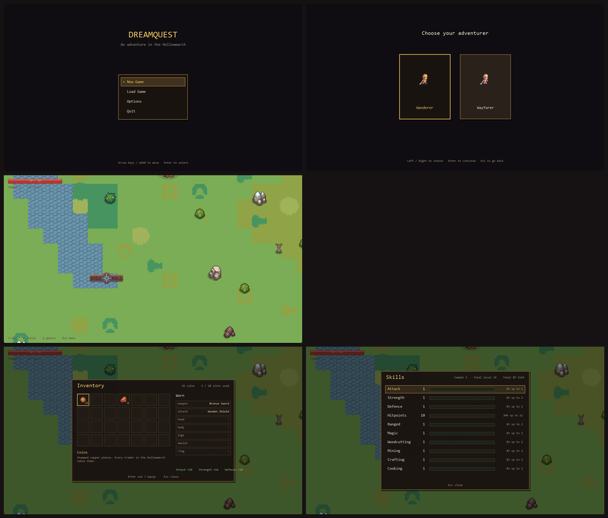

# DreamQuest

A top-down adventure RPG in C++ and SDL3, in the Dragon Quest Monsters mould:
a scrolling overworld with several biomes, a village you can walk into and out
of, houses and a guild hall you can enter, mountain mines and a barrow to raid,
Old School RuneScape-style skills, weighted loot tables, three melee attacks
built around a hold-to-charge heavy swing, bows that fire real arrows, a
four-element spell system with an effectiveness triangle, and a soundscape
synthesised entirely in code.

Built on [SDL3-Project-Template](https://github.com/Dexsidius/SDL3-Project-Template),
and the maps are authored in the format exported by
[LevelEdit-Plus](https://github.com/TheSardonicals/LevelEdit-Plus).



---

## Building

### Windows (MSYS2 UCRT64)

```bash
pacman -S mingw-w64-ucrt-x86_64-gcc mingw-w64-ucrt-x86_64-sdl3 mingw-w64-ucrt-x86_64-sdl3-image mingw-w64-ucrt-x86_64-sdl3-ttf
```

```powershell
.\tools\import_assets.ps1 -GameAssets "E:\Game Assets"   # once, to build assets/
.\build.ps1 -Run
```

### Linux / macOS

Install SDL3, SDL3_image and SDL3_ttf, then:

```bash
./compile_and_run.sh
```

### Other build targets

| Command | What it does |
| --- | --- |
| `.\build.ps1` | Build the game |
| `.\build.ps1 -Run` | Build and launch |
| `.\build.ps1 -Debug` | Unoptimised build with symbols |
| `.\build.ps1 -Test` | Build and run the self-test |
| `.\build.ps1 -Maps` | Regenerate `maps/*.mx` |
| `.\build.ps1 -Tools` | Build `tilecut`, `genmaps` and `selftest` |

`./compile.sh test`, `./compile.sh maps` and `./compile.sh tools` do the same on
Linux.

### Running it outside MSYS2

`bin\DreamQuest.exe` can be double-clicked. Two things make that work, and both
had to be dealt with explicitly:

- **The runtime libraries travel with the exe.** Nothing is on the PATH outside
  an MSYS2 shell, so the build walks the DLL dependency tree with `objdump` and
  copies everything that resolves inside MSYS2 next to the executable — 18
  libraries, because SDL3_ttf pulls in FreeType and HarfBuzz, which between them
  pull in libpng, zlib, bzip2, Brotli, GLib, PCRE2 and Graphite. A hand-written
  list of these was wrong, and the symptom is Windows refusing to start the
  program with no message at all.
- **The game finds its own data.** `data/` and `assets/` are opened by relative
  path, so started from Explorer the working directory is `bin\` and every file
  fails to open. On startup it locates the directory holding `data/sprites.json`
  — beside the exe, then one above it — and moves there, so saves and settings
  land in the project root wherever it was launched from. If it genuinely cannot
  find them it says so in a message box rather than closing silently.

---

## Assets

The art is [CraftPix](https://craftpix.net) free content. That licence permits
using the assets in a game but not redistributing the files, so **no art is
committed here**. `tools/import_assets.ps1` rebuilds `assets/` from the `.zip`
packs you downloaded:

1. Unpacks each pack into `assets/_raw/`
2. Copies the character animation sheets under short, stable names
3. Cuts the flat ground fills out of the packed tilesets with `tilecut`
4. Cuts buildings, decorations and item icons out of the packed sheets
5. Copies the individually-shipped props (trees, rocks, bushes)
6. Regenerates `data/sprites.json` and `data/asset_manifest.json` to match

Everything lands on the exact paths the committed data and maps refer to, so
the game runs as soon as it finishes. The packs used are listed in
[docs/ASSETS.md](docs/ASSETS.md).

---

## Controls

The game is played on the keyboard or a controller; the mouse does nothing.
Both are live at once by default and the game switches to whichever you last
touched. Options → Input Device pins it to one if you would rather.

On the keyboard the left hand steers, sprints, jumps and interacts, and the
right rests on `J` `K` `L` for the fight, with the panels on the row above.

| Action | Keyboard | Controller |
| --- | --- | --- |
| Move | WASD / arrows | Left stick or d-pad |
| Light attack | `J` | X (west) |
| Heavy / charged attack | `K` (hold to charge) | Y (north) |
| Lock on / next target | `L` | Right trigger |
| Sprint (hold) | `Shift` | Left trigger |
| Jump / climb | `Space` | Left stick click |
| Interact | `E` | A (south) |
| Inventory | `I` or tab | LB |
| Skills | `O` | RB |
| Quest journal | `P` or `Q` | Back |
| Select element | `1` `2` `3` `4` | — |
| Cycle element | `R` | Right stick click |
| Pause | `Esc` | Start |

In menus the fighting keys double up the way a controller's face buttons do:
`J`, `E`, `Space` or `Enter` confirms, and `K`, `Backspace` or `Esc` backs out.
A panel's own key closes it again. The death screen ignores input for its first
moment, so the last swing of a lost fight does not skip straight past it.

### Sprinting

Hold `Shift` (or the left trigger) while moving to sprint at 1.6 times running
speed, for crossing the world rather than for fighting: it cannot start during
a swing or a charge, and taking a hit knocks you out of it for most of a second.
The camera leads a sprint by a few steps so you can see what you are running
into, footfalls come further apart, and each one kicks up dust outdoors. The
hero has a sprint animation of its own; the CraftPix characters, which do not,
play their run faster instead.

Sprinting costs **stamina**, the amber bar with the lightning bolt under health
and mana. A full bar is 100 and a sprint spends 22 a second, so about four and a
half seconds flat out. It starts coming back 0.8 seconds after you stop --
30 a second standing still, 60% of that on the move -- so a breather is worth
taking. Run it dry and you are **winded**: the bar pulses red, you hear the
character catch their breath, and you cannot sprint again until it has refilled
to 35%. That threshold is what stops an empty bar being tapped into a
stuttering sprint. Respawning restores it; it is not saved, because it is back
to full within seconds of any load anyway.

### What the attack buttons do

The buttons never change; the weapon in your hand decides what comes out of
them. A sword swings, a bow shoots, a staff casts. All three run through the
same attack state machine, so the charge mechanic works for every style.

### The three attacks

- **Light** — fast, cheap, and it chains. Three hits in a row, each a little
  slower and a little harder than the last.
- **Strong** — tap the heavy button. Slower, hits considerably harder.
- **Charged** — *hold* the heavy button. Past about a fifth of a second the
  swing starts charging and a meter appears under your feet; it turns bright
  when it is full. Release to fire. A full charge is worth roughly three times
  a normal strong hit and reaches further, but it roots you while it winds up.

### Targeting

Nothing is aimed by hand. Where a shot goes depends on whether you are in a
fight:

- **Out of combat**, an arrow or a spell flies straight the way the character
  is facing. A deer grazing off to one side is not something the game decides
  you meant to shoot.
- **In combat**, shots go to the monster you are fighting, and the character
  turns to loose them. Combat starts when a monster is chasing or swinging at
  you, or once you have struck it -- so the first arrow at a deer goes where
  you face, and the ones after it follow the deer. A monster that gives up and
  walks home drops out of the fight.

When several monsters are in the fight, the target is the nearest with a clear
line to it, weighted toward the way you face: turning toward one is how you
choose between two. A pale arrow over its head marks it, and its name, level
and health appear at the top of the screen.

`L` (or the right trigger) **locks on**. The first press takes the monster the
fight is already with, or the nearest one in reach; each press after steps to
the next one further out, and a press past the last lets go. A lock can be put
on anything within reach, fighting or not, and it holds while you move and turn
away -- the target gets a red arrow and a red ring at its feet, the frame at the
top says LOCKED, and standing still you face it. It lets go by itself when the
monster dies or gets far enough away.

Arrows **steer** after their target, so a shot at something moving still
arrives; fire bolts and air bolts turn a little, and water and earth fly
straight. A shot never circles back for a target it has already passed. With a
sword, a swing turns to face a target within reach, but not one across the
field. The numbers live in `src/world/targeting.h` and the `homing` field of
`data/projectiles.json`.

---

## Projectiles and magic

Arrows and spells are the same system. Everything that separates a bowshot
from a firebolt — speed, reach, how many bodies it passes through, what it
leaves on the ground — is data in `data/projectiles.json`, and the art is one
sprite drawn turned along its direction of travel, so a single arrow image
covers every angle.

### The four elements

You select an **element**, not a spell. Your Magic level decides which tier of
that element actually comes out, so training Magic upgrades what the same
button does instead of adding another thing to remember.

| Element | Signature behaviour | Feel |
| --- | --- | --- |
| **Fire** | Leaves the ground burning where it lands, ticking damage on anything standing in it | Area denial |
| **Water** | Runs straight through a line of bodies | Piercing |
| **Earth** | Lands heavy and bursts a moment later, after a visible wind-up | Slow, high commitment |
| **Air** | Very fast, long range, and it carries what it hits backwards | Kiting |

### The effectiveness cycle

```
Water  →  Fire  →  Earth  →  Air  →  Water
```

Each element beats the next: water douses fire, fire scorches earth, earth
smothers air, air disperses water. Hitting a creature with the element that
beats it does **1.6×** damage and the damage number comes up in that element's
colour with an exclamation mark; being on the wrong end of the cycle does
**0.6×** and reads grey. An element resists itself at **0.75×**, and anything
untyped — most wildlife — takes normal damage from everything, so the matchup
is a reward for paying attention rather than a tax for not.

Monsters are aligned in `data/enemies.json`: orcs and boar are earth, foxes
are air, the Warchief is fire.

### Mana

Casting costs mana, which comes from the Magic level (`12 + level × 2`) and
refills on its own. The bar only appears once you have some, so a pure melee
character is never told about a resource they do not spend.

---

## Skills

Fourteen skills on the Old School RuneScape XP curve — the real one, so level 92 is
half the experience of 99, and the self-test checks the table against known
values.

| Skill | Trained by |
| --- | --- |
| Attack | Landing light attacks |
| Strength | Landing strong and charged attacks |
| Defence | Taking hits |
| Hitpoints | All damage dealt |
| Woodcutting | Chopping trees, with an axe |
| Mining | Working ore seams, with a pickaxe: the foothills and the Mire, the mines and barrow, and the dreamworld |
| Fishing | Fishing the Fernhollow pond, the Whisperwood stream and the Hollowmarch lake, with a rod |
| Cooking | Using a fire with something raw in your pack |
| Crafting | Workbenches in Havenbrook and Mossvale: wood, leather and thread |
| Smithing | Smelting and smithing at the anvils in Halda's forge and Mossvale |
| Foraging | Picking herbs and plants, by hand; see [Foraging](#foraging) |
| Brewing | Brewing potions at a cauldron; see [Brewing](#brewing) |
| Ranged | Landing arrows with a bow equipped |
| Magic | Casting spells with a staff equipped |

Combat level uses the OSRS formula across the melee/ranged/magic triangle.

A potion can lift a combat level above its base. The Skills panel then shows the
level it is working at over the real one in green ("47/40"), and a boost wears
off a point every 45 seconds.

Ranged and Magic read their own level and their own equipment bonus for both
accuracy and damage, exactly as OSRS does, so a bow does nothing for a
character who never trained Ranged and Strength does nothing for a bow. The
self-test checks that.

### Skill trees

Each combat style has a tree, opened from the Skills panel (`O`) with `I` and
`O` to step between the tabs -- Skills, Melee, Ranged, Magic -- or the shoulder
buttons on a pad. A tree is three branches, five nodes deep:

| Tree | Earned by | Branches |
| --- | --- | --- |
| Melee | Attack | Blade, Brawn, Guard |
| Ranged | Ranged | Marksman, Skirmisher, Hunter |
| Magic | Magic | Evoker, Channeler, Warden |

**Every fifth level of the tree's skill is a point**, and a node costs one. The
rows are milestones -- **levels 5, 15, 30, 50 and 70** -- and a node also needs
the one above it in its branch. So the first point is a choice of direction, a
level 70 character has most of one branch and some of the others, and a whole
tree takes until level 75. `J` learns the node under the cursor; `L` twice
unlearns the whole tree and gives the points back, for anyone who wants to try
another way to fight.

Most nodes are passive: more damage, faster attacks, critical strikes (half
again the damage, marked with a `*`), healing on hit, knockback, defence,
stamina, mana cost and regeneration, spells that seek their target. A few apply
whatever you hold -- defence, stamina, move speed, mana regeneration, faster
charging -- and the rest only to attacks of their own style.

**The middle of every branch, at level 30, is a technique**: a new move. Once
learned, `J` on it makes it that style's charged attack, so holding and
releasing `K` with that style's weapon comes out as the technique instead of a
plain charged hit. No new buttons, and the HUD says what a held heavy attack
will do ("Hold K: Whirlwind").

| Style | Technique | What it does |
| --- | --- | --- |
| Melee | **Whirlwind** | Spins, striking everything around you |
| Melee | **Ground Slam** | Slams the ground, hitting and throwing back everything nearby |
| Melee | **Lunge** | Dashes forward, striking everything in the way |
| Ranged | **Piercing Shot** | One fast, heavy arrow that passes through everything in its path |
| Ranged | **Volley** | A fan of five arrows |
| Ranged | **Arrow Rain** | A storm of arrows comes down on your target a moment later |
| Magic | **Nova** | A ring of eight bolts of your element, for twice the mana |
| Magic | **Barrage** | Four seeking bolts at once, for twice the mana |
| Magic | **Meteor** | Your element crashes down on your target, for three times the mana |

The capstones at level 70 are Bloodlust, Titan and Last Stand for melee;
Deadeye, Hail and Bloodletting for ranged; Archmage, Overflow and Elemental
Mastery for magic. The whole tree is data, in `data/skill_trees.json`, and the
nodes are saved with the character.

---

## Material tiers

Weapons and armour come in nine tiers, in this order:

| Tier | Needs | Worked from | Mined at | Found |
| --- | --- | --- | --- | --- |
| **Wood** | -- | logs, hide, thread | -- | trees everywhere |
| **Bronze** | -- | copper ore | Mining 1 | the foothills |
| **Iron** | 10 | iron ore | Mining 5 | the Mire, the Cursed Reach, the upper mine |
| **Steel** | 20 | iron ore and coal | Mining 20 | coal in the high foothills, the Cursed Reach and the mines |
| **Azuryte** | 30 | azuryte ore and coal | Mining 30 | the highest foothills and the barrow |
| **Adamantium** | 40 | adamantium ore and coal | Mining 40 | the lower mine |
| **Diamond** | 50 | rough diamond | Mining 50 | the barrow |
| **Platinum** | 60 | platinum ore and coal | Mining 60 | the lower mine |
| **Demonrite** | 70 | demonrite ore and dream shards | Mining 70 | only in the dreamworld, around the Nightmare Brute |

Every tier makes the same seven pieces -- a **sword, bow, staff, shield, helm,
cuirass and greaves** -- and every piece needs its tier's level in the skill it
is used with: Attack for a sword, Ranged for a bow, Magic for a staff, Defence
for the rest. Every tier also makes two tools, an **axe** and a **pickaxe**,
which need the tier's level in Woodcutting or Mining; see
[Gathering](#gathering). Each metal tier has an **ore** and a **bar**. Ore is smelted into
bars at an anvil, and bars are smithed into the pieces there too; wooden pieces
are made at a workbench.

**Smithing** is its own skill, and it follows the tier milestones exactly:
smelting a tier's bar and smithing anything from it needs **Smithing at the
tier's level** -- the same number that wearing or wielding the result asks for.
Bronze is Smithing 1, iron 10, steel 20, and so on up to demonrite at 70. Before
Smithing existed every bar and blade trained Crafting, so a save from then starts
its Smithing where its Crafting stood and loses nothing it could already make. The item panel names an item's tier and says what it
needs, in red-letter "needs" when you do not have it yet.

The tiers are one data file, `data/tiers.json`: for each tier its level, its
power, its colour and its ore and bar, and for each piece its slot, its skill
and how its stats and recipe scale. The game builds every item and recipe from
that when it loads (`ItemDatabase::LoadTiers`), so a piece is always exactly as
strong as its tier says. The items that existed before -- the bronze and iron
swords, the Steel Longsword, the Oak Shortbow, the Wooden Shield, the iron
shield, helm and cuirass -- are the tier pieces now, under their old ids, so
saves, quests and loot tables still find them. Recipes that are not an item's
own "craft" (one bar makes seven things) are kept alongside the items, and the
crafting panel scrolls, with icons, now that the anvil alone makes sixty-odd
things. There is a second anvil in Mossvale.

### The tier art

Every ore, bar, weapon and armour piece is modelled in
`tools/blender_tiers.py`, from the same rounded parts, cel shading, majority
reduction and outline as the player hero, and rendered headlessly:

```powershell
.\tools\make_tiers.ps1                          # icons and weapon layers
.\tools\make_tiers.ps1 -What icons              # just the 79 icons
.\tools\make_tiers.ps1 -What layers -Only attack -Models sword_iron
```

Tiers are told apart three ways at once, because at game size colour alone is
not enough: each has its own **palette**, its own **silhouette** -- a wooden
sword is short and blunt, bronze a leaf blade, adamantium a heavy cleaver,
diamond a faceted crystal, platinum long with a winged guard, demonrite jagged
and horned -- and the top tiers carry **something that glows**: azuryte's cyan
edge, diamond's white sparks, platinum's gold halo, demonrite's red heat.

The same models are what the hero holds. For every tier's sword, bow and staff
the script poses the weapon in the hero's hand for every frame of every clip and
renders it as a layer, cut by the body and head the way the hero's own sword
is -- `layers/<clip>_4_weapon_<model>.png`, 216 sheets -- and the game draws the
one for whatever is equipped in place of the default sword. A bow and a staff
are carried out and forward of the arm, stood up straighter than the hand
hangs; held where a sword is, their upper half vanished behind the sleeve and a
bow read as a blue sword. Armour has no layer on the character and shows, as
before, as its tier's colour over the body. The icons are 32 pixels, framed
automatically so a sword and a lump of ore both fill their square.

The same script draws every tier's axe and pickaxe, the fishing rod and the ten
fish, raw and cooked, and poses the tools in the hero's hands through the chop,
mine and fish clips (`layers/chop_4_weapon_axe_<tier>.png` and so on). In an icon
a tool has a shorter haft and a bigger head, turned side-on, or at 32 pixels an
axe and a pick were both a stick with a speck on the end. Cooked fish keep a
little of their own colour, so a roast pike and a roast salmon differ in the bag.

### Where things are made

Each recipe is made at one station, decided by its materials, and trains that
station's skill. **Anything brewed -- anything with a herb or a vial in it -- is
brewed at a cauldron**, with Brewing. **Anything that
needs metal is smithed at an anvil**, with Smithing -- in Halda's forge in Havenbrook, or
beside the workbench in Mossvale: every bar, every metal tier's pieces, and the
Copper Ring. **Everything else is made at a workbench**, in Havenbrook or
Mossvale, with Crafting: the wooden tier, the Leather Jerkin, the Fishing Rod, the Bedroll and the Dreamcatcher.
The two used to share one list, so a village workbench could smith an iron
shield.

Nothing declares its station. Materials carry `"metal": true` -- every ore and
bar made by `data/tiers.json` does -- and a recipe with any metal input
belongs at the anvil, so a new recipe cannot be filed in the wrong place. A
crafting object in a map names the station it is with `"station"`; the
self-test checks every recipe against its materials, and that every station in
the world is drawn as what it works as. Each station's screen says what is made
at the other, so a missing recipe reads as elsewhere rather than gone.

---

## Gathering

**Chopping needs an axe, mining a pickaxe, and fishing a fishing rod**, carried
in the bag. Without one, the prompt says so before the button is pressed ("Chop
oak  -  needs an axe") and pressing it does nothing. With several, the fastest
one the player has the level for is used; one they carry but cannot yet use is
named in the refusal ("Your Iron Pickaxe needs Mining 10").

How long a tree, a seam or a cast takes is its base time divided by the level
and the tool together: every level is 2% quicker, and every tier of axe and
pickaxe is quicker than the one below. Measured on the same oak at Woodcutting
70, a demonrite axe takes 0.58 seconds a log and bronze 1.08.

| Tier | Axe and pickaxe speed | Needs |
| --- | --- | --- |
| Wood | 1.00x | -- |
| Bronze | 1.15x | -- |
| Iron | 1.30x | 10 |
| Steel | 1.45x | 20 |
| Azuryte | 1.60x | 30 |
| Adamantium | 1.75x | 40 |
| Diamond | 1.90x | 50 |
| Platinum | 2.05x | 60 |
| Demonrite | 2.25x | 70 |

Axes and pickaxes are made like the rest of their tier: wooden ones from three
logs at a workbench, metal ones from two bars and a log at an anvil. The
**fishing rod** is one rod, made at a workbench from two logs and a waxed thread;
the Fishing level alone decides how quickly things bite. Every new character
starts with a bronze axe, a bronze pickaxe and a rod, and a character from a
save made before tools were needed is handed the same set the first time it
loads, so nobody is left unable to chop the logs to make an axe from.

While the work goes on the hero **plays its own animation** and holds the tool
instead of the weapon: a two-handed swing round from the shoulder into the
trunk, a pick lifted high and driven down into the rock, and the rod held out
over the water with a slow bob and the odd twitch of the wrist. Walking,
attacking or jumping stops the work.

### Fishing

**Fishing** is its own skill. A fishing spot is drawn as rings spreading on the
water with the odd bubble: three on the Fernhollow pond (one off the end of the
jetty), three on the Whisperwood stream, and four along the Hollowmarch lake.

| Fish | Fishing | Caught in | Cooked, heals | Cooking |
| --- | --- | --- | --- | --- |
| Minnow | 1 | pond, stream, lake | 4 | 1 |
| Trout | 15 | pond, stream | 9 | 15 |
| Pike | 30 | pond, lake | 13 | 30 |
| Salmon | 45 | stream | 17 | 45 |
| Eel | 60 | lake | 22 | 60 |

Each spot gives up the best fish the level allows about a third of the time,
more often the further past it the level is, and something lesser otherwise.
Raw fish cook at any fire into food.

The **milestones** are the chance a cast brings up more than one fish. With
Fishing selected in the Skills panel they are listed along the bottom:

| Fishing | Two fish | Three fish |
| --- | --- | --- |
| 20 | 10% | -- |
| 40 | 20% | -- |
| 60 | 30% | -- |
| 80 | 30% | 10% |
| 99 | 30% | 20% |

A cast that lands more than one says so in gold ("+ 2 Raw Trout").

### Foraging

**Foraging** is picking herbs and plants. It needs no tool: stand at a plant and
press `E`, and the hero kneels and picks it with the weapon put away. A picked
plant is left as cut stubs and **grows back** after a few game hours -- three for
a marigold, nearly nine for a starlily -- and what has been picked is saved. Past
a plant's level, each level adds a one in a hundred chance it gives two, up to
half the time.

| Herb | Foraging | Grows best |
| --- | --- | --- |
| Marigold | 1 | the meadow round Havenbrook |
| Brookmint | 6 | wherever land meets water: the lake shore, the Whisperwood stream, the Fernhollow pond |
| Stinging Nettle | 12 | the greenwood, and along the Whisperwood trail |
| Bogbean | 20 | the Mire |
| Mountain Sage | 28 | the foothills, thicker the higher up |
| Glowcap | 36 | the shade just inside the Whisperwood's trees |
| Emberbloom | 46 | the burnt ground of the Cursed Reach |
| Moonpetal | 56 | the Reverie's islands |
| Starlily | 68 | only the Reverie's crystal field |

Each is scattered thinly over its own ground, and on the overworld each has
**one patch where it grows thick**, found by `tools/genmaps.cpp` by looking out
from a rough spot for somewhere its whole round is the right biome. Oona keeps a
garden of the three beginner herbs beside her cottage in Mossvale. The plants'
levels and XP come from their items in `data/items.json` (`"forage"`), so the maps
and the items cannot disagree.

### Brewing

**Brewing** turns herbs and a glass vial into potions at a **cauldron**: in
Havenbrook by the cooking fire, in Oona's cottage, at the Fernhollow camp and by
the candles in the Reverie. Vials are sold at every general store.

A recipe has to be **learned** before it can be brewed. The cauldron lists every
brew, but one not yet learned shows as "Unknown recipe" and says where to learn
it. Oona teaches the first -- ask her "Could you teach me to brew?" -- and the
rest are **recipe scrolls**, read from the pack, sold by traders around the
world. Learned recipes are saved as world flags (`recipe:<id>`).

| Potion | Brewing | Ingredients | Effect | Recipe from |
| --- | --- | --- | --- | --- |
| Healing Draught | 1 | 2 marigold | 20 hitpoints | Oona teaches it |
| Mana Tonic | 6 | 2 brookmint | 40 mana | Oona |
| Nettle Brew | 12 | 2 nettle | Strength +3 and a tenth | Tobin's General Store |
| Fen Bitters | 20 | 2 bogbean, marigold | all stamina, 12 hitpoints | Hob the Pedlar |
| Stoneskin Draught | 28 | 2 mountain sage | Defence +3 and an eighth | Garrow's Smithy |
| Hunter's Focus | 36 | 2 glowcap, nettle | Ranged +4 and an eighth | Ivo's Bows and Hides |
| Emberfire Elixir | 46 | 2 emberbloom | Attack and Strength +4 and an eighth | the Collector |
| Moonlit Draught | 56 | 2 moonpetal, brookmint | 80 mana, Magic +5 and an eighth | the Night Pedlar |
| Starlily Panacea | 68 | 2 starlily, moonpetal, marigold | 40 hitpoints, 100 mana, all stamina, every combat level a little | the Collector, after Lights on the Pond |

Every brew also takes one vial, and each is brewed at the Foraging level of its
rarest herb, so the two skills climb together. A boost is the OSRS kind: a flat
amount plus a share of the level, never stacking past its own ceiling, and a
second potion of the same kind is refused -- not wasted -- while the first holds.
Food and potions alike are refused when they would do nothing. Oona buys brews,
and every brew is worth at least 1.8 times its herbs, like anything crafted.

The art is original. The plants (each growing and picked) and the cauldron are
modelled in `tools/blender_props.py` and rendered with `make_props.ps1`; the
herb, vial, potion and recipe-scroll icons are built in `tools/blender_tiers.py`
beside the fish (`.\tools\make_tiers.ps1 -What brewing`); the kneel-and-pick
`gather` clip is in `tools/blender_character.py`.

---

## Trading

Talk to a trader and pick the trade line ("Let me see what is for sale.", "Buying
any fish?") and the shop opens. Anyone who trades says so in the prompt: "Talk to
Smith Halda  -  trades". The trade line is always there, whatever else the
conversation is gated on.

The shop has two tabs, switched with `A`/`D` (left and right on a controller).
**Buy** lists what is on the shelf with its price and how many are left today;
**Sell** lists everything in the pack with what this trader pays, dimmed when they
do not deal in it, and names the trader who would pay more. `J` (A) buys or sells
one; hold `Shift` (left trigger) to buy ten or sell the whole stack. `K` leaves.

### Who is where

Every town and significant place has a general store and at least one other
kind of shop.

| Place | General store | Other shops |
| --- | --- | --- |
| Havenbrook | Tobin's General Store, a stall on the square | **Halda's Forge**; the Inn Kitchen (Bess); Ivo's Bows and Hides (Hunter Ivo) |
| Mossvale | Pell's Stall | **Garrow's Smithy**, at the village anvil; Oona's Remedies |
| Fernhollow | Nell's Cart, by the path to the jetty | Wendel's Jetty, a fishmonger |
| Whisperwood camp | Hob's Pack, a pedlar resting at the camp | Bram's Woodpile |
| The Reverie | The Night Market (the Night Pedlar) | Curios of the Deep Dream (the Collector) |

### Prices

Prices come from an item's value. A shop charges its markup on the value --
1.0 at a forge, up to 1.3 for a pedlar out on the trail -- and pays a fraction of
it for the things it deals in:

- **Forges** pay 75% for ore, bars and metal, and 70% for weapons, armour and tools.
- **Specialists** pay well for their own trade: Wendel 80% for fish, Bram 80% for
  timber, the Inn Kitchen 70% for anything raw, Ivo 75% for bows, Oona 80% for
  herbs, the Collector 85% for dream shards.
- **General stores** take anything with a price, at 40% (45% in the Reverie).
- Coins and quest items are never bought or sold.

Every rate is below every markup, so nothing can be bought in one shop and sold
in another for more than it cost. The profit is in work:

- **Gathering pays.** Copper ore fetches 8 coins at a forge, a raw trout 19 at
  Wendel's, an oak log 14 at Bram's.
- **Working it pays more.** Anything crafted is worth at least 1.8 times its
  materials (`ItemDatabase::CRAFT_VALUE_ADD`), and cooked food is worth twice
  the raw: a cooked trout sells for 38.
- **Smithing bought bars pays too**, as far as the day's stock goes. Two bronze
  bars and a log cost 84 coins and make a sword Halda buys back for 107; an iron
  sword is 196 in and 248 out, and a steel cuirass 2415 in and 3042 out.

### Limited stock

What a shop sells runs out: ten bronze bars a day at Halda's, two steel bars,
one iron pickaxe. **Every shop restocks at dawn**, when the quest day turns over,
and the dawn message says so: "New notices are up, and the traders have
restocked." What has been sold today is saved.

Better stock is gated on the story, the same way dialogue is:

- Halda has only bronze bars, iron ore and a sword or shield until her forge has
  its copper (Ore for the Forge); then iron bars, coal, steel and an iron
  pickaxe go on the shelf.
- Garrow's azuryte waits on the Trail Wardens, Bram's iron and steel axes on
  clearing the trail, Oona's tonics on Wendel's remedy.
- The Collector opens the better cases after The Water Remembers and Lights on
  the Pond: adamantium, platinum and demonrite ore, and a dreamcatcher.

**No shop sells what a quest asks you to gather or deliver**, unless that quest
is already finished -- and never what a daily asks for. Nobody sells copper ore,
logs, hides, minnows or dream shards, so the dailies and the early quests stay
work rather than a purchase.

Shops are data, in `data/shops.json`: the keeper, the town, the markup, what they
buy (by item tag -- `ore`, `bar`, `weapon`, `fish`, `raw`, `tier:wood`, or `*` for
anything; see `Trade::Tags`), and the shelf, with a daily stock and optional
`after` quests for each line.

---

## Worn equipment

The CraftPix character packs ship their frames already split into layers —
shadow, the weapon behind the body, the body, the head, the weapon in front —
all frame-aligned, with a number in each filename giving the draw order. The
importer keeps that split, so the player is drawn as a paperdoll rather than a
flattened sheet.

- **Weapons are real layers.** What you are holding is drawn from its own
  layers and coloured to match the item, so a bronze sword, a steel longsword,
  a bow and a staff all look different in your hand. An empty hand hides the
  weapon layers entirely.
- **Armour draws, and can also tint.** A worn piece carries a `worn` overlay:
  art drawn on top of the character, positioned by a rectangle given in **frame
  pixels** so it lands on the rig correctly at any camera zoom. A piece with no
  overlay art falls back to colouring the body and head layers instead, so
  plain items still read as armour.

```json
"plumed_helm": {
  "worn": {
    "sprite": "assets/icons/armour/worn/plumed_helm.png",
    "after": "head",
    "rect": [26.2, 21.5, 10.5, 13.0],
    "facings": [true, true, true, true]
  }
}
```

There are nine slots — weapon, shield, head, body, hands, legs, feet, amulet,
ring — drawn from the feet up, so a helmet ends up over a gorget and a gauntlet
over a sleeve.

A bow takes both hands. Equipping one puts the shield in the bag, and taking up
a shield puts the bow away; if the bag has no room for what would come off, the
swap is refused rather than the item being lost. The first playtests had a
character loosing arrows with a shield on the other arm. A weapon that brings its own overlay hides the rig’s built-in
sword layers, and is mirrored when the character faces right so it is not held
backwards.

### On using icon packs as armour

CraftPix icon packs (fantasy knight armour, RPG boots, mage outfits, daggers)
are 512×512 painted inventory art. Three things follow, and they are different
problems:

- **Proportion is solved, by measurement.** The rig was measured rather than
  guessed: in an idle frame the head layer covers x25..38 y22..35, the torso
  x25..38 y32..44, the shadow under the feet y40..47. Each slot gets a box in
  those coordinates, every icon is trimmed to its drawn pixels at import, and
  the art is fitted inside its box the way a picture fits a frame. Sizing by
  height alone would make a broad pair of gauntlets narrower than an arm;
  sizing by width alone would run a tall tasseted skirt up to the chin.
- **Facing is solved, by testing it.** A single painted view means that in
  profile the character wears a front-on breastplate. Restricting armour to the
  facings it "really" reads in was the obvious answer and the wrong one: at
  twenty-odd pixels tall the front-on view does not read as wrong, whereas a
  character who strips naked the moment they walk sideways very much does. So
  everything is worn from every angle.
- **Style is not solved.** A smooth, anti-aliased 512px icon shrunk to 24px
  reads as a soft blob against 16px-grid pixel art. The importer hardens the
  worn copy — alpha cut to on-or-off, colours stepped to eight levels per
  channel — which gives it a defined edge and a flatter palette, and helps a
  great deal. It still will not pass for hand-drawn pixel armour.

So icons are used where they are strongest: full size in the inventory, and as
a worn overlay you can judge for yourself. Proper pixel-art armour layers drop
into the same slots with no code change.

---

## Projectiles and walls

An arrow or a bolt is stepped in slices no longer than half its own radius, so
nothing passes through a wall between frames. When a step would end inside
geometry, `Map::SweepPoint` answers two questions instead of one:

- **Where it actually stopped** — the last position that was clear, so an
  impact is drawn on the surface and a fire patch burns in front of a wall
  rather than half inside it.
- **Which way that wall faces** — worked out by trying each axis on its own,
  the same way `MoveWithCollision` decides which axis to stop a walking
  character on. If moving in X alone is still clear, it was the Y movement that
  hit something, so the surface is horizontal. Both axes blocked means a
  corner.

The normal is what makes a response possible. Air bolts ricochet — twice for
`gust`, three times for `galewind` — each bounce reflecting about the surface
and costing some speed, so a shot rattling down a corridor settles rather than
pinging forever. Air is the element that gets this because it is the one with
no ground effect: glancing off a wall is what makes it read as air rather than
as a weaker fire bolt.

Everything else stops, and leaves a mark: a flash in the element's colour and
three shards thrown back off the face. Those shards are fixed rather than
random — a spray that reshuffles every frame reads as noise. Without any of
it, a bolt that hit a wall and one that ran out of range looked identical.

A projectile spawned inside geometry, which happens if you fire with your back
against a wall, reports a zero normal rather than an invented one and simply
stops.

---

## Original assets

Every pack in this project is someone else’s art, and the packs do not cover
everything. `tools/blender_props.py` builds props from primitives in code and
renders them headlessly:

```powershell
.\tools\make_props.ps1                    # render, then convert
.\tools\make_props.ps1 -SkipRender        # convert existing renders
.\tools\make_props.ps1 -Only signpost     # one prop
```

Blender renders each prop eight times larger than needed; `make_props.ps1` then
box-downsamples it, flattens the palette, adds a dark rim around the
silhouette, and draws a contact shadow from the prop’s own base. The outline is
the single biggest thing separating a render from the hand-drawn art it sits
beside.

Three things were learned the hard way and are worth knowing before adding a
prop:

- **The camera angle is measured, not chosen.** The CraftPix interior tables
  show their front edge, their legs, and only a sliver of the top — a little
  over thirty degrees above the floor. Rendering at fifty-five hid every table
  leg behind its own top.
- **Model everything far thicker than life.** At fifty-six pixels across a
  two-metre frame, a realistic signpost is two pixels wide and vanishes under
  the outline pass.
- **Buildings need more height than feels right.** The first Mossvale lodge
  read as a lawn on a box: from above, a roof is most of what you see. Taller
  walls in alternating log tones and a dark shingle roof with only patches of
  moss fixed it.
- **Big renders need Cycles tiling.** Rendering a 192-pixel building at eight
  times scale ran Blender out of memory until `setup_render` turned on
  auto-tiling with 256-pixel tiles.
- **This does not beat hand-drawn art at these sizes.** Simple, chunky shapes
  — a signpost, a barrel, a strongbox — come out well. A bookshelf full of
  books does not. Use it for what the packs genuinely lack.

### The player hero

`tools/blender_character.py` builds the Hollow-born character, poses it and
renders every clip -- idle, walk, run, sprint, attack, jump, hurt and death, in
all four facings -- straight into the layered sheets the game reads:

```powershell
.\tools\make_character.ps1                    # every clip, then data/sprites.json
.\tools\make_character.ps1 -Only walk,sprint  # a couple of clips
```

The first version was bevelled boxes and read as boxes -- a crate of a head on
planks. The second is modelled the way a sprite is drawn rather than the way a
3D model is built:

- **Rounded forms.** Ellipsoids and tapered capsules only, so the silhouette
  curves and limbs join without seams: spiky hair with bangs and side locks,
  big eyes, a flared tunic with a belt and buckle, round-toed boots, and a red
  scarf whose tail streams out behind at speed.
- **Proportions matched to the CraftPix rigs**, so worn armour overlays authored
  against them still land: the head sits in the same band of the frame.
- **Cel shading.** Diffuse light through a three-step constant ramp, the shadow
  band shifted cool, from one fixed sun at the upper left so every facing is lit
  from the same side as the scenery.
- **Majority reduction, not averaging.** The render is four times game size;
  each game pixel takes the most common colour of the sixteen under it, so the
  bands stay flat and a two-pixel eye stays two pixels. Averaging turned the
  same render to mush.
- **A selective outline**: one pixel round each layer in a darkened version of
  the colour it borders, rather than flat black.
- **Occlusion between layers.** Each layer renders with the always-drawn layers
  in front of it as holdouts, so the scarf tail is cut away where the body hides
  it, and the sword is cut where the body stands in front of it -- in all four
  facings, from one weapon layer. Optional layers never cut others, or an empty
  hand would leave a hole.

The animation is poses written as functions of time rather than keyframes: a
shared gait drives walk and run (knees bending most on the passing step, the
body lowest at footfall, arms against legs, shoulders against hips), and the
sprint exaggerates it until it reads as a different gear at twenty-five pixels
-- a hard lean, the trailing leg driven out straight, the leading knee high,
both feet off the ground between strides, fists pumping. Leaning toward or away
from a camera above only slides the head down over the body, so the up and down
rows keep a fraction of the lean that the side rows show in full. Idle blinks.

---

## Elevation

The ground has height. A map may carry a coarse grid under its `dreamquest`
key, one level per cell:

```json
"elevation": {
  "cell": 64, "cols": 64, "rows": 48,
  "levels": [ 0, 0, 1, 2, ... ],
  "ramps":  [ [x, y, w, h], ... ],
  "face":   "assets/tiles/dirt_dark.png"
}
```

Level 0 is the ground everything used to sit on, so a map with no elevation
block behaves exactly as it did before. Each level lifts what stands on it by
`ELEVATION_RISE` pixels; `Map::LevelAt` and `HeightAt` answer for any world
point, and the world tells every entity its lift once a frame rather than
looking it up inside each draw call.

**Movement.** Stepping between cells of different level is blocked — that is
what makes a cliff a cliff. `ramps` are rectangles where the rule is suspended,
and the overworld puts one along the full length of the road and a clearing
around every place you can enter, because a raised map without them is a set of
islands. The self-test checks exactly that: every portal and the starting spawn
sit on flat ground, and every row of the map has a crossing somewhere on it.

**Drawing.** Ground and scenery are lifted by the terrain under them — scenery
by the ground under its base, not its middle, so a tree at the lip of a bank
belongs to the ground its trunk is on. Then the exposed banks are drawn:
soil texture down the face, grass rolling over the lip, a shadow thrown on the
ground below, and a dark line down the east and west edges so a plateau has an
outline all the way round rather than on one side only.

Four things were got wrong first, and all four are the same mistake — assuming
something would read that did not:

- **A face on its own is a brown bar.** Flat-filled faces looked like a stripe
  painted across the grass, because every other surface in view had grain and
  that one did not. They are textured now.
- **Higher ground has to look higher.** With the same grass above and below,
  the face is just a line between two identical fields. `LevelShade` darkens
  the ground floor slightly and gives it back a level at a time, so the top
  terrace is the texture as drawn. Colour modulation cannot brighten past the
  source, so it has to work in that direction.
- **The grid has to be coarser than the tiles.** At one level per 32px tile the
  terraces came out small and their edges fragmented into two- and three-tile
  bars. At 64 the plateaus are broad and their edges run far enough to read.
- **Height from smooth noise is a staircase.** A clean function of latitude
  terraces the whole map into straight bands from edge to edge. The slope is
  broken up with noise stretched along the east-west axis so each contour
  wanders.

Still to do: the faces are drawn procedurally, and dedicated cliff-edge art
would look considerably better than a textured rectangle with a lip on it.

### Getting up and down

**Jump** (`Space`, or left-stick click) is a hop in the direction you are
steering, or facing if you are not. Into a ledge up to `Player::CLIMB_LEVELS`
(two) high it carries you up onto it; off one it drops you down; on flat ground
it is a short hop. It plans the whole jump before leaving the ground -- every
sample along the path must be clear of walls and within two levels of where you
started, so it never passes through a tree or over a sheer cliff to land on the
far side -- and then owns the player until it lands: no steering, no attacks,
no knockback. Airborne, the draw lift is blended between the two terrain
heights plus an arc, so a climb rises smoothly instead of snapping up at the
edge.

A climbable ledge is otherwise indistinguishable from a wall you cannot pass --
you walk into either and stop -- so pushing against one puts **Climb up** or
**Drop down** on screen.

**Stairs.** Where a ramp crosses a level change the face is drawn as a flight
of stairs with stone cheeks, not as a cliff. Ramps used to be invisible
rectangles: walkable, but indistinguishable from the cliff either side.

Without jumping, **923 of the overworld's 3,072 height cells -- 30% of the
map -- could not be reached from the spawn.** The self-test now floods the
height grid from the spawn, allowing walking, ramps and jumps of up to two
levels, and fails if anything is left over.

### A bug worth remembering

The guild hall could not be entered, and it looked like the doorway was on a
cliff. It was: the overworld's. `Map::Unload()` cleared everything except the
height grid, and the parser only ever writes that grid when a map has one, so
a building never overwrote it -- walk from the overworld into any interior and
the interior inherited the hills outside. Every other self-test loads each map
into a fresh `Map`, which can never see that; the new check loads the overworld
and each building into the *same* one, the way the game does, and fails with
the fix reverted.

---

## Ground tiles

`tools/make_ground.ps1` generates them:

```powershell
.\tools\make_ground.ps1
```

They used to be one flat colour each, which was not an accident — they are cut
from CraftPix tilesets by looking for cells that are fully opaque with zero
variance, because those are the palette swatches a tileset is designed to be
laid over. It works, and it is why the overworld read as coloured paper: a
screen of grass was one RGB value repeated four thousand times.

The generated ones carry speckle, blades and grit. Every mark is placed with
wrapped coordinates, which is what makes them seamless — a blade running off
the right edge continues at the left, so there is no seam to line up. Several
variants per family, because one perfect tile repeated across a 4096-pixel map
is still a visible grid; `genmaps.cpp` picks between them with a hash of the
cell coordinates, and asks the asset manifest how many exist rather than being
told.

The road is generated too. The pack's cobbles are a cool blue-grey, and laid
three tiles wide through green grass the Sunken Road and Havenbrook's street
read as a river. It is warm grey setts in running bond now, a full 32-pixel cell
of sixteen stones in three variants, so it no longer shows as a two-by-two
check.

The other half of the coloured-paper problem was the biome boundaries. The
colour drift is smooth noise, and thresholding smooth noise draws a clean
contour — which on a 32px grid is a staircase of squares. The threshold is
jittered per cell now, which dissolves that edge into a scatter of cells from
both families.

---

## Day and night

A day lasts twelve real minutes: half a minute to the hour. The light starts to
go at six in the evening, it is fully dark by half past eight, dawn begins at
five and full daylight is back at seven. The clock only runs while you are
playing, and it is saved, so a night is still a night after a reload. A new
game starts at nine in the morning of day one.

Night is drawn as a light map multiplied over the finished scene
(`src/world/lighting.cpp`): a screen-sized target is cleared to the colour of
the light -- white at noon, amber at sunset, a cold blue at midnight -- and
every light is added onto it as a soft glow before it is laid over the world.
Cooking fires, hearths, the forge and camp fires throw flickering pools of
firelight, fire and air bolts light their way, burning ground glows, and the
player carries a faint light of their own so nobody is lost in the dark. Houses
only dim half as much and are lit by their hearths; the mines keep their own
darkness at any hour. At noon nothing is drawn at all.

Outdoors the birds fall quiet as it gets dark and the crickets start.

### Sleep and the dreamworld

From **seven in the evening until four in the morning** you can sleep, and
sleeping is a journey: the screen fades, "You drift off to sleep...", and you
wake up somewhere else -- **the Reverie**, the dreamworld, for as long as the
night lasts. Earlier than seven, a bed tells you it is for after dusk. You cannot
sleep with a hostile monster nearby.

There are three kinds of place to sleep:

- **Beds** -- Elder Maren's, the three guest rooms at the Barley and Bell,
  Oona's in Mossvale and the ferry cottage's double bed in Fernhollow.
- **Campsites** -- the tents at Bram's camp on the Whisperwood trail and at the
  traveller's camp in Fernhollow.
- **Your own camp.** Every new character starts with a **Bedroll**, and more are
  made at a workbench from 2 waxed thread and 2 raw hide. Use it from the bag
  under open sky and it pitches a tent and a fire where you stand. After dusk it
  offers "Sleep at your camp"; by day, "Pack up your camp" puts the bedroll back
  in your bag. There is one camp at a time -- pitching another packs the first
  away -- and it stays where you left it, on its map, across saves. Not indoors,
  not in the mines, not on uneven ground and not on top of a way out.

Going to sleep restores health, mana and stamina.

**The Reverie** is five cloud islands over a starry void, joined by plank
bridges to the one you arrive on. It is lit a dream's violet, wisps of light
drift up out of the void, and the ambience is a slow shimmering chord with
chimes far off. A voice on the arrival island explains the rules:

- **Dawn ends the dream.** At five in the morning you wake exactly where you lay
  down, rested. The HUD counts down to it ("Dreaming  dawn in 3:12").
- **The waking stone** beside where you arrive wakes you straight away, with the
  night still going, if you would rather.
- **You cannot die in a dream.** A nightmare that bests you throws you awake, in
  your bed, whole -- but the rest of the night goes with it.

The islands are where the night's work is. **Nightmare Shades** haunt the grove
to the north, **Dread Boars** graze the meadow to the west, the field to the east
has **dream crystals** to mine (Mining 1), and to the south a **Nightmare Brute**
guards a chest. They are the waking world's orcs and boars in a bad night's
colours, and what they drop is real: **dream shards** come back with you, and
six of them with two thread make a **Dreamcatcher** at a workbench, an amulet
worth +10 Magic, +8 Ranged and +4 Defence.

A save made in a dream remembers where you are sleeping, so loading it carries
on the same dream and wakes you in the same place.

---

## The HUD

Health and mana sit in the top left in brass plates: a bevelled frame lit from
the top left, a sunk track with quarter ticks, rivets at the corners of the
health bar, and a heart or droplet glyph at the left end so the two bars are
told apart at a glance rather than by colour alone.

Under them, a slimmer amber bar with a lightning bolt is stamina, spent by
sprinting; it pulses red and reads "winded" when it has been run dry.

Under those, a sun or a moon and the time: "Day 2  21:40  Night". It turns
blue once it is late enough to sleep, and in a dream it counts down to dawn.

With a technique chosen in a skill tree, the line under the prompts says what
holding the heavy attack will do; with a staff it is on the spell line.

In a fight, a frame at the top centre names the target with its level and
health, and says LOCKED in a red border while the lock is on. The line along the
bottom lists the keys: attack, heavy, target, sprint, bag, skills, quests, menu.

The top right is a round minimap under a brass bezel with rivets, cardinal
notches and an amber pip at north. It is north-up and centred on the player:
terrain in the average colour of each ground tile, portals green, NPCs blue,
living monsters red, and the player gold with a nose pointing the way they
face. The map's name sits under the dial. Toasts and the quest tracker stack
below it, and the FPS counter moved to the bottom right.

The terrain is baked once per map into a small image -- one pixel per 8 world
pixels outdoors, per 4 in houses so a room is not a thumbnail -- and drawn as a
stack of one-pixel strips, each as wide as the circle at that height. That
keeps the map round without a mask or a shader and pixel-for-pixel crisp; the
game still holds its 72 fps cap.

The bezel is generated by `tools/make_ui.ps1` and the glyphs live in
`tools/icons.txt`; both run as part of `import_assets.ps1`.

---

## Sound

There are no audio files. `src/systems/audio.cpp` synthesises every effect at
start-up -- 39 of them, from tones, filtered noise, struck-metal partials and
Karplus-Strong plucked strings -- and plays them through one SDL3 audio stream
with a small mixer.

- **Combat:** swings (pitched up through a light chain, heavier for strong and
  charged attacks), hits, critical hits, blocked hits, deaths, the bow's twang,
  a cast pitched by element, arrows striking walls, and a monster's swing as it
  winds up. A killing blow is heard as the death rather than a hit on top of it.
- **The world:** footsteps by distance walked -- earth outdoors, planks indoors,
  stone in the mines -- chopping and mining strikes while you work, cooking and
  burning, chests, doors, locked doors, portals, pickups and coins, eating and
  equipping.
- **Progress:** level-up arpeggio, quest start and quest complete fanfares.
- **Sleep:** a slow falling arpeggio as you drift off, and a rising one with a
  bell when you wake.
- **Fishing:** a line going into the water, and the same splash, higher, when
  something bites.
- **Menus:** cursor ticks, confirm, back and error, handled once in
  `Game::Update` rather than in every screen.

Sounds in the world are panned and fade with distance from the player, and
anything but a menu sound varies its pitch a few percent so a run of hits does
not sound mechanical.

**Ambience** is generated live, per map kind, and cross-fades on every map
change: wind with slow swells and birdsong in the forest, groves and fields;
a low breathing drone and echoing drips in the mines; a hearth's rumble and
crackle indoors; a quiet wind on the title screen. At night the birds give way to crickets, and
the dreamworld has three detuned sines drifting against each other under
far-off chimes.

Options has Master, Effects and Ambience volume. With no playback device the
game runs silently rather than failing.

---

## Item icons

Most inventory icons are cut from the CraftPix RPG UI icon sheet, but that
sheet has no log, bow, staff, hide, ore or roast, and those items had been
given the nearest cell in spirit. Playing the game showed how far off that was:
the Training Bow was a blue sword, Raw Hide and the Leather Jerkin were a boot,
both staves were an eye on a green tile, Roast Boar was a blue lump, and logs
and ore were metal ingots.

Those thirteen are drawn by hand instead, as text in `tools/icons.txt` — one
character per pixel, with a small palette per icon — and painted by:

```powershell
.\tools\make_icons.ps1
```

Text rather than image files so they can be read, diffed and touched up without
an image editor. `import_assets.ps1` runs this and `make_ground.ps1` at the end
of an import, because both overwrite or add to what the import cuts; the import
also runs `make_decals.ps1` for the ground decals.

---

## Attack speed and cooldown

Weapons declare a `speed`, a multiplier on swing time, so **lower is faster**:
a dagger is 0.70, a bronze sword 1.00, a steel longsword 1.30. It scales every
phase of the swing and the cooldown after it, so a weapon’s whole rhythm moves
together rather than just the part you can see — and the animation is played at
a matching rate, or the character is still following through when the hitbox
has gone. Reach, width and knockback are deliberately left alone: those are
properties of the weapon’s shape, not of how fast it moves.

The property had been in `data/items.json` since the beginning and nothing ever
read it. `Equipment::AttackSpeed()` existed and was never called.

**Cooldown** is separate from recovery. Recovery is part of the swing and you
are committed during it; the cooldown is the gap *after* it, and it is what
stops the attack button being something you hold down. Mid-chain light attacks
have almost none, which is what makes continuing a combo quicker than starting
one; the finisher, the strong attack and the charged attack each cost more.
Bare-handed that works out at a sustained 2.2 hits a second, which the
self-test measures rather than assumes.

It is shown, because a gate the player cannot see is just an unresponsive
button: a thin bar under the feet that drains, gone inside a fifth of a second
between light attacks. The inventory states the speed as a rate — "1.14x
(fast)" — rather than as the raw multiplier, because a stat where smaller is
better needs explaining every time it is read.

Ranged and magic go through the same state machine, so a bow’s speed is its
rate of fire and a stave’s is its cast rate, with no extra code.

---

## Quests

Quests reach you three ways, all of them live:

- **The mission board** in Havenbrook — four contracts, gated on level and on
  what you have already finished, plus the day's two daily notices.
- **Innkeeper Bess** has something living in her cellar: *Rats in the Cellar* sends
  a new character down the hatch behind the bar to kill six rats, four spiders and
  the broodmother, and back up to tell her.
- **NPC conversations** — Elder Maren runs the main chain (a letter, a missing
  surveyor, and what is gathering the orcs under Emberfell). The innkeeper,
  the smith, the watchman and the hunter have their own.
- **The woodland villages** -- Mossvale's notice board and the people of
  Mossvale, Fernhollow and the Whisperwood camp give the woodland chain.
- **Notes left in the world** — a water-stained note at the edge of the Mire
  starts the barrow chain, and a torn survey page on the Sunken Road advances
  Maren's.
- **The dreamworld** — Mira at the Fernhollow shrine and Hesper the ferryman's
  widow send you to sleep with a purpose, and the Dreamer's Slate in the
  Reverie posts its own notices.

### Prerequisites

A quest can need other quests finished first, a Combat level (`"req":
{"Combat": 12}`) and skill levels. **No one offers a quest you cannot start**:
an offer is gated on the quest being *available* -- not started, every
prerequisite done, every level met -- rather than merely not started, which is
what let Maren ask about the Sunken Road before the letter had been carried.

| Quest | Needs |
| --- | --- |
| The Sunken Road | Maren's letter, Combat 5 |
| Orc Trouble | Thin the Herd, Combat 6 |
| The Barrow Seal | Combat 10 (started from its note) |
| Trail Wardens | Clear the Trail |
| Emberfell Depths | The Sunken Road, Combat 12 |
| The Water Remembers | The Old Offering |
| Lights on the Pond | The Water Remembers, Combat 18 |

Dialogue conditions can ask for a quest's state (`not_started`, `available`,
`locked`, `active`, `complete`), a stage, an item, a skill or Combat level,
quests finished (`"after": [...]`), a world flag or its absence (`"flag"`,
`"no_flag"`), and the time of day. A condition that needs the player's state
and is asked without it fails rather than passing, so a line never shows by
default. Some flags are set by the world itself: `visited:<map>` the first
time a map loads, so Hesper talks about the lights differently once you have
seen the Reverie.

When there is nothing to give yet, the NPC says so instead of going quiet:
Maren, asked for more work between chapters, tells you to come back stronger.

A Talk objective is only met by the option that advances it, and a Deliver
objective by the option that takes the items. Opening a conversation used to
tick every Talk stage for that NPC, so greeting Oona before fetching the herb
finished the errand.

### Daily notices

Repeatable quests are posted in **pools**, one per board, and each pool puts up
**two a day**. The day turns over **at dawn**, not midnight, so a night's sleep
is what brings new notices, and the traders restock, and the HUD says "New
notices are up, and the traders have restocked." when it happens. Which two are up is decided by the pool and the day
alone, so it is the same after a reload. A daily can be done once per posted
day; the journal counts how many times.

| Pool | Notice | Task | Needs |
| --- | --- | --- | --- |
| Havenbrook | Barley Watch | 5 boar | -- |
| Havenbrook | Road Patrol | 5 orcs | Combat 6 |
| Havenbrook | Fish for the Inn | 5 raw minnows to the cook | -- |
| Havenbrook | Kindling | 10 logs to the cook | -- |
| Mossvale | Fox Patrol | 6 foxes on the Whisperwood trail | Clear the Trail |
| Mossvale | Tannery Stock | 4 hides to Hadley | -- |
| Mossvale | Oak for the Lodge | 5 oak logs to Pell | Woodcutting 12 |
| The Reverie | Nightmares Undone | 8 nightmares, asleep | The Water Remembers |
| The Reverie | Shards for the Shrine | 8 dream shards to Mira | The Water Remembers |
| The Reverie | The Brute Returns | the nightmare brute, asleep | Lights on the Pond, Combat 18 |

Dailies are never *collect* stages, which would count what is already in the
bag: they are hunts or hand-ins, so each one is work done that day. The boards
mark them "daily" with their level, and the detail pane says when the next
ones go up.

### Order books

**Smith Halda** and **Old Wendel** take orders, every day. Ask Halda "Any
orders today?" (or Wendel "Any fish wanted?") and the day's orders open on the
board panel, with what each asks for, how many you carry, what it needs and
what it pays. Accept one, bring the goods, and pick "I have an order for you."
-- that line only appears when an order of theirs can be filled from the pack,
and it hands in every order it can at once.

Orders are dailies in a pool of their own. **Halda posts three a day, Wendel
two**, new at dawn, and each can be filled once a day. A posted order is never
one the player cannot take yet: an order needing Smithing 20 is passed over for
the next in the day's order, so a new character always has at least two to
choose from, and the book fills out as the skills rise.

Halda's orders pay **Mining XP and coins**, and the smelted and smithed ones
**Smithing XP** as well:

| Kind | Order | Needs | Mining XP | Smithing XP | Coins |
| --- | --- | --- | --- | --- | --- |
| Ore | 10 copper ore | -- | 450 | -- | 143 |
| Ore | 8 iron ore | Mining 5 | 520 | -- | 187 |
| Ore | 6 coal | Mining 20 | 900 | -- | 583 |
| Ore | 4 azuryte ore | Mining 30 | 1200 | -- | 864 |
| Ingots | 6 bronze bars | -- | 600 | 360 | 216 |
| Ingots | 5 iron bars | Smithing 10, Mining 5 | 900 | 540 | 432 |
| Ingots | 3 steel bars | Smithing 20, Mining 20 | 1400 | 840 | 1304 |
| Weapons | 2 bronze swords | -- | 500 | 400 | 275 |
| Weapons | 1 iron sword | Smithing 10 | 700 | 560 | 319 |
| Weapons | 1 steel longsword | Smithing 20 | 1600 | 1280 | 2273 |
| Hide | 8 hides | -- | 250 | -- | 94 |
| Armour | 2 bronze helms | -- | 450 | 360 | 375 |
| Armour | 1 iron cuirass | Smithing 10 | 1100 | 880 | 1124 |
| Armour | 1 steel greaves | Smithing 20 | 2200 | 1760 | 3392 |

Wendel's pay **Fishing XP and coins**:

| Order | Needs | Fishing XP | Coins |
| --- | --- | --- | --- |
| 10 raw minnows | -- | 300 | 78 |
| 8 cooked minnows | -- | 200 | 108 |
| 6 raw trout | Fishing 15 | 450 | 188 |
| 5 cooked trout | Fishing 15, Cooking 15 | 400 | 252 |
| 3 raw pike | Fishing 30 | 520 | 176 |
| 3 raw salmon | Fishing 45 | 600 | 273 |
| 2 raw eels | Fishing 60 | 650 | 260 |

Filling an order always pays more than selling the same goods to any trader.
Some orders ask for things a shop stocks -- Halda sells bronze bars, and the
inn sells cooked minnows -- and for those the coins are set below the shelf
price, so buying the goods to fill the order costs more than it pays: the XP
can be bought, at a loss, but the money is in mining, smelting, smithing and
fishing it yourself. The two old dailies that were really orders, the forge's
copper and Wendel's pike, are now in these books.

### Quests in the dreamworld

- **The Water Remembers** (Mira): sleep, find the voice in the Reverie and
  listen to it, and tell Mira what it said. Magic and Hitpoints XP, coins and
  dream shards.
- **Lights on the Pond** (Hesper): hunt the nightmare brute in the Reverie and
  bring Hesper six dream shards. Attack and Defence XP, coins and a
  dreamcatcher.

The **Dreamer's Slate** stands on the Reverie's central island and carries the
reverie dailies. The hunts can only be finished asleep, before the dream ends
at dawn; the shards for Mira are gathered in the Reverie and handed in awake.

---

## The world

`maps/overworld.mx` is 4736 × 3456 pixels — about nine screens across — and
the camera scrolls it as a viewport on the player. Biomes: meadow, greenwood,
northern foothills, the Mire, and the Cursed Reach, joined by the Sunken Road,
with the Whisperwood trail leaving from the east.

| Map | What it is |
| --- | --- |
| `overworld` | The Hollowmarch |
| `town_havenbrook` | The village, with four enterable buildings |
| `guild_hall`, `house_elder`, `house_inn`, `house_smith` | Interiors |
| `dungeon_emberfell_1` / `_2` | The mine, upper and lower workings; the lower level is locked until you find the rusted key, and the Warchief holds the last room |
| `dungeon_barrow` | Beneath the Mire |
| `whisperwood_trail` | The forest path east of the Hollowmarch: a woodcutter's camp, a stream with a plank bridge, and a fork |
| `mossvale` | A logging village behind a palisade at the trail's east end |
| `mossvale_lodge_hall`, `mossvale_herbalist` | The reeve's lodge and Oona the herbalist's cottage |
| `fernhollow` | A hamlet on a pond at the north fork, with a shrine and a ferry cottage |
| `fernhollow_cottage` | The ferryman's widow's cottage |
| `dreamworld` | The Reverie, reached only by sleeping: five cloud islands over the void |
| `house_inn_cellar` | Under the Barley and Bell, down a hatch behind the bar: rats, spiders and a broodmother |
| `ice_spire_peak` | North off the foothills, Combat 30: a climb through trolls to the wyverns' summit |
| `ashen_path` | East off the Hollowmarch below the Cursed Reach, Combat 40: a burnt road across rivers of lava |
| `dungeon_infernal` | The Infernal Pit, through the hellgate at the Ashen Path's end: imps, demons and the Pit Lord |

### The Whisperwood

A dirt trail leaves the overworld's east edge ("To the Whisperwood") and
winds through a forest dense enough that the path is the way through. Bram the
woodcutter camps where it crosses a stream; past him it forks, east to Mossvale
and north to Fernhollow. The trail is a map of its own rather than more
overworld because that is what makes it read as *a journey to somewhere* -- you
leave one place, travel, and arrive in another, the way DragonFable and
AdventureQuest Worlds stitch their zones together.

Mossvale and Fernhollow each have their own people, dialogue and quests: a
five-quest woodland chain (clear the trail, carry word to Fernhollow, hides for
Mossvale, the trail wardens, and an offering at the shrine), with kill stages
tied to the map they belong on so a wolf in the Mire does not count toward the
Whisperwood.

### Making zones feel like places

- **Arrival banners.** Entering an outdoor zone or dungeon fades in its name
  and a one-line subtitle over the screen for a few seconds. Walking in and out
  of a house does not re-announce the town you were already in.
- **Ambience.** Each map declares an `ambient` kind and `src/world/ambience.cpp`
  drifts particles through the world to match: falling leaves and fireflies
  under a darkened vignette in the forest, fewer of both in the village groves,
  pollen over the fields, dust in the mines. Particles live in world space and
  respawn on the far edge of the view, so they scroll with the ground rather
  than sliding across the screen.
- **Exit markers.** Near the edge of an outdoor map, each way out is labelled
  with an arrow and its destination -- "To the Whisperwood >" -- so the edges
  of a zone are signposted rather than discovered by walking into them.
- **Warnings at dangerous doors.** A portal can carry the Combat level its
  far side is meant for. Below it, the door prompt says so -- "Enter the
  Emberfell mine - dangerous: Combat 6 advised" -- where a new character used
  to find out by dying in the first room.
- **Legible banners.** The zone name sits on a feathered dark band; gold text
  over the foothills' sand was close to unreadable.
- **Clear streets.** Trees and tall fungus are drawn up from their base, so the
  generator keeps them two tiles back from every road; bushes may still line it.
- **A mine that is a hole in a hill.** The Emberfell mine used to be a door
  sprite standing on open dirt. It is a hillside now (`prop_mine_adit`): terraces
  of broken rock with scrub on the ledges, a timber-framed tunnel mouth with a
  lantern on the lintel, rails running out of the dark to where the Sunken Road
  now ends, an ore cart and a spoil heap, and loose rock either side where it
  runs back into the foothills. The portal is the dark of the tunnel itself.
  A piece of scenery can now sort against people above its base
  (`"sort_lift"` in a map): the hill sorts at the back of the tunnel, so someone
  standing in the mouth is drawn in front of the rock around them rather than
  ghosting the whole hillside out.
- **A barrow that is a grave.** The barrow in the Mire was a door sprite on the
  grass beside a mushroom. It is a long turf mound now (`prop_barrow_mound`),
  its passage framed by two standing stones and a capstone with a facade of
  slabs curving out either side, flagstones up to the door, a faint green light
  far down the passage and a skull on a stake. The portal is in the doorway.
- **Stairs, not doors, underground.** Inside every dungeon the way out was a
  door standing in the middle of the first room and the way down another in the
  last. The way out is a stone flight now, climbing into the first room's top
  wall toward daylight (`prop_dungeon_stairs_up`, set against solid rock so it
  never blocks a corridor), and the way down a stairwell in the floor with a
  kerb, a parapet and a torch (`prop_dungeon_stairs_down`).
- **Things lying on the ground.** The overworld was scattered with round blobs,
  squares with holes in them, chevrons and keyholes, each a flat colour. They
  were cut from the CraftPix road pack's `Ground_grass` sheet by the importer,
  and they are not decorations: they are that sheet's stencils, the masks its
  autotiles use to blend grass into a path. `tools/make_decals.ps1` draws what
  a field actually has in it instead, on transparent ground -- clumps of meadow
  and shade grass, wildflowers, fallen leaves, pebbles, straw-coloured hill grass
  and cracked stones, scorch cracks on the Cursed Reach, and sedge and puddles
  in the Mire -- and genmaps lays each only on its own ground.
- **Room to the west.** The Mire ran into the edge of the world. The Hollowmarch
  has grown twenty cells west and twelve south, out of the same noise, so the
  swamp, its bog pools and lizardmen, the river and the foothills carry on
  instead of stopping. The north and east edges, where the ways out are, did not
  move. So nothing already built had to be renumbered, the old cells kept their
  coordinates and the new ones are negative: `MapBuilder::ox` adds an offset to
  every x a map places. Saves are version 2; a position saved on the overworld
  by an older build is moved the same 640 pixels east when it is loaded, so a
  character stands on the same ground they saved on.

Maps are big enough to grow: the base layer is bucketed into chunks and culled
against the camera, so adding another biome costs load time and nothing else.

### The Mire

The swamp in the west of the Hollowmarch was laid from three tiles cut out of
the cursed-land pack, and one of them, `marsh_dark`, turned out to be a patch of
black cliff face: a third of the Mire was a streaked black void with rust-coloured
dirt decals on it. It is generated ground now (`tools/make_ground.ps1`) -- sedge,
peat and mud -- with **pools of bog water** that cannot be walked through, reeds
and bulrushes round their edges, lily pads on them, and drowned trees hung with
moss. The dirt decals are no longer laid on it. The pools keep clear of the
barrow, the chest, the bogbean patch and the camp.

The Mire belongs to the **lizardmen**. They are scattered through it, and in its
south their camp stands round a fire: three huts up on stilts, painted totems,
and their chief.

## Monsters

| Monster | Where | Effective level | Leaves |
| --- | --- | --- | --- |
| Cellar Rat | the inn's cellar | 1 | bones, raw meat, a few coins |
| Cellar Spider | the inn's cellar | 3-4 | spider silk |
| Broodmother | the back of the inn's cellar | 7 | silk, coins, a tonic or a copper ring |
| Lizardman | the Mire | 10-13 | lizard scales, bogbean, iron ore, hides |
| Lizardman Chief | the camp in the Mire | 16 | scales, iron bars, a steel sword, Fen Bitters |
| Ice Troll | the Ice Spire's slopes | 26-29 | troll hide, adamantium ore, azuryte gear |
| Frost Wyvern | round the Ice Spire's summit | 33-36 | wyvern scales, platinum ore, adamantium gear |
| Wyvern Matriarch | the summit | 40 | scales, platinum gear, diamond ore |
| Imp | the Ashen Path and the pit | 30-34 | coins, emberbloom, platinum ore, the odd horn |
| Demon | the hellgate and the pit | 40-43 | demon horns, demonrite ore, platinum gear |
| The Pit Lord | the pit's last room | 54 | horns, demonrite bars and gear |

Each place is a step up from the one before, and none is a wall: monsters in the
new areas are spaced along the way, do not chase far, and the Ice Spire has a camp
at its foot to rest, cook and sleep at. The drops trade: Ivo buys silk, scales and
hides, and the Collector in the Reverie pays best for trophies.

The **ways in** to the harder places are closed until a character could survive
them. A portal can carry `min_combat`: below it, the prompt says "needs Combat 30"
and a step-through edge turns the player back with a message rather than letting
them in to die. The Ice Spire needs Combat 30, the Ashen Path and the hellgate
Combat 40.

**Hazards.** A map can carry `hazards`: ground that burns while it is stood on,
a bite every half second with the number over the player's head. The Ashen Path
is crossed three times by rivers of lava, fordable only where the path crosses
them, and those fords burn; the Infernal Pit has lava vents in its corridors.
Jumping over a vent is safe.

A monster's `scale` in `data/enemies.json` now actually draws it bigger -- it was
read and never used -- so a broodmother, a chief, the matriarch and the Pit Lord
are the same art as their kin, only larger and tinted.

### The art

Every new monster is original, modelled and animated in
`tools/blender_creatures.py` (`.\tools\make_creatures.ps1 [-Only wyvern]`) from the
hero's parts, cel shading and reduction: a small tree of joints per creature with
rounded meshes hung on them, and an idle, walk, attack, hurt and death clip each,
four facings, the shadow composited in. Frames are sized per creature at the
hero's scale -- 48px for a rat, spider or imp, 64 for a lizardman, 80 for a troll
or demon, 112 for a wyvern -- with the feet the same fraction of the way down the
frame, so `data/sprites.json`'s anchor stands them on their position.

Two things worth knowing before adding one. About a joint's X axis a positive
pitch leans a limb built upward *forward* and swings a hanging one *back*; the
first wyvern had its neck and tail the wrong way round and read as a sitting
blob. And from this camera, anything behind a head draws above it on screen: the
first ice troll's mane hid its face.

The swamp, peak and pit props -- reeds, lily pads, swamp trees, stilt huts,
totems, ice spires and crystals, snowy pines, wyvern nests, charred trees,
obsidian, the hellgate, the cellar hatch and cobwebs -- are in
`tools/blender_props.py`; the drops' icons in `tools/blender_tiers.py`. The peak
has falling snow and a hard wind, and the Ashen Path rising embers, as their own
kinds of ambience.

---

## Level editor integration

Maps are the `.mx` format LevelEdit-Plus exports:

```json
{ "name": "...",
  "tiles": { "grass": { "filepath": "assets/tiles/grass.png",
                        "locations": [[cx, cy, w, h], ...] } } }
```

Placements are centre-anchored, matching `GameTile::Render` in the editor, so a
map drawn here lines up pixel-for-pixel with the editor view.

Everything a game needs on top of that — draw layers, collision, portals, spawn
points, enemies, NPCs, objects — lives under a separate `"dreamquest"` key.
**The editor ignores keys it does not recognise**, so these maps open in
LevelEdit-Plus, can be edited by hand, saved, and still run.

`tools/tilecut.cpp` exists because of the editor: the CraftPix tilesets ship as
packed autotile sheets, and the editor works with one image file per tile. It
cuts the atlases into individual tiles and finds each separate drawing on the
packed object sheets, so the same art is usable in both programs.

To rebuild the world from scratch: `.\build.ps1 -Maps`.

---

## Saving

Three slots, plus an autosave every two minutes and one on quitting to the main
menu. A save records the map, your exact position and facing, HP, every skill's
XP, inventory, worn equipment, quest progress, and the one-shot world flags —
which chests you have opened and which notes you have read — plus the day and
the hour, where your camp is pitched, what every trader has sold today, and, for
a save made asleep, where you are dreaming from — so loading puts
you back exactly where you left off. Saves are written to a temporary file and
renamed, so an interrupted write cannot destroy the previous one.

---

## Self-test

```powershell
.\build.ps1 -Test
```

Screenshots prove the game runs; they do not prove that the mission board names
a quest that exists, that every dialogue option leads somewhere, or that a loot
table only drops real items. `tools/selftest.cpp` links the game's own systems
and checks all of it — currently **10684 checks** covering:

- every sprite sheet and item icon exists on disk
- every loot table drops real items, and quest-critical drops are guaranteed
- every quest objective, prerequisite and reward resolves, and every quest has
  a giver somewhere in the world
- the dialogue graph is fully connected
- no NPC offers a quest that is not yet available, and every Talk and Deliver
  stage has a hand-in option reachable from that NPC, shown only while the quest
  is at that stage; Maren, Hesper, the smith and Wendel open with the right
  lines for a new character and for one further on
- the quest day turns over at dawn; dailies are never collect stages, every
  pool posts two a day and rotates, a daily cannot be repeated the same day but
  can on a later day it is posted, completions are counted, and all of it
  survives a save
- the dream quests played through the world at night: sleeping into the
  Reverie, reading the voice, reporting to Mira, Hesper's hunt, and the reverie
  dailies posted on the Slate
- order books: Halda's orders cover ore, bars, weapons, hides and armour, and
  pay Mining XP and coins; Wendel's are fish and pay Fishing XP; every order
  pays more than selling the goods, needs the Crafting or Fishing level its item
  takes, and costs more to fill from a shelf than it pays; on every one of forty
  days a new character is posted at least two orders they can take and none they
  cannot, and a skilled one sees more of the book; the order line appears only
  when an order can be filled, hands in exactly what it asks and leaves the rest,
  pays once, cannot be repeated the same day, and never takes another NPC's
  delivery
- traders: every shop is kept by an NPC standing in its own town, who can be
  walked up to and offers to trade from the first line; every town has a general
  store and another shop; every shelf item exists, has a price and a limited
  stock; forges sell materials and buy ore, bars and metalwork but not fish; no
  shop sells a quest's items before that quest is done, or a daily's ever
- prices: nothing bought anywhere sells anywhere for what it cost; every recipe
  makes something worth 1.8 times its materials; everything gathered sells
  somewhere and sells for more cooked; every piece smithed from a forge's bars
  sells for more than the bars cost
- trading: buying takes the price and the stock, never more than is left or
  affordable, and a full pack is not charged; stock stays sold out the same day,
  survives a save and comes back at dawn; gated stock appears once its quest is
  done; selling pays and refuses what a trader does not deal in; choosing a
  trader's trade line closes the conversation and opens their shop
- the grown Hollowmarch and its ways in: the overworld is 4736 by 3456 with its
  height grid covering all of it and every arrival on the map; the Mire carries
  on into the new west with lizardmen in it, and the land carries on south; none
  of the road pack's grass stencils are on the ground and every kind of new
  decal is; the barrow is a mound with its portal in the doorway and no door
  sprite; every dungeon is left by a stone flight and gone deeper into by a
  stairwell; and an overworld save from before the map grew loads with the
  player and their camp on the same ground
- monsters and the new places: every new monster has its sprite, all five clips
  drawn and a loot table; lizardmen and their chief hold the Mire, rats, spiders
  and the broodmother the cellar, trolls, wyverns and the matriarch the Ice Spire,
  imps the Ashen Path and demons and the Pit Lord the pit, none spawned inside a
  wall, with the cellar a beginner's fight, the peak between 24 and 42 and the pit
  harder still; the Mire has no black cliff tile, and is sedge, peat and mud with
  bog pools, reeds, lily pads, drowned trees, huts and totems; the Ice Spire is
  closed below Combat 30 and the Ashen Path and the hellgate below 40, and in the
  world a new character walking into the Ice Spire's path stays in the Hollowmarch
  while a veteran walks on up; the pit has lava vents that burn to stand in and
  the Ashen Path fords that burn to cross; the cellar quest can be taken, is
  finished by the cellar's own rats, spiders and broodmother but not by rats
  anywhere else, and by telling Bess
- all twenty-one maps load; portals point at real maps; every enemy, NPC and object
  resolves
- the OSRS XP table matches known values
- a starting character can actually win the first fight the level 1 board quest
  sends them into
- every projectile has art on disk, actually moves, is slow enough that its
  sub-steps cannot carry it through a wall, and is not drawn larger than the
  character firing it
- attack speed orders swings correctly, a zero speed is clamped rather than
  swinging instantly, every attack leaves a gap, and a bare-handed chain is
  neither a machine gun nor so slow that combat drags
- a sweep into a wall stops clear of it and reports a normal that sends a
  bounce back the way it came, while open floor reports no contact at all
- no portal or spawn sits on a cliff edge, every row of the overworld has a
  walkable crossing, and no raised ground is sealed off from the spawn once
  ramps and two-level jumps are counted
- no building inherits the overworld's height grid when loaded after it
- every NPC and usable object in every building can be walked up to from the
  door
- every portal in the woodland zones can be walked to from where you arrive,
  and the Whisperwood, Mossvale and Fernhollow journey round-trips
- every portal arrives at a spawn that exists, not inside a wall, and not on a
  step-through portal that sends the player straight back -- which is what a
  flight of stairs between two floors would otherwise do
- every way back through a portal arrives beside the way in, so leaving a
  building puts you on its doorstep rather than in the middle of town
- real fights, run frame by frame through the world update with the buttons
  pressed through the game's own input: a new character fighting back beats a
  fox and a boar, and the monster never stands on top of the player
- a monster's health bar stays hidden until it is attacked, shows for as long
  as it is hurt, and never shows more than it has; its fill is within a pixel
  of hp / max_hp, never empty while alive and never full while wounded
- every corpse despawns within three seconds of death, and a revived monster
  comes back whole with its bar hidden
- the HUD art is on disk, and the minimap clips every row to the edges of the
  map without ever sampling outside it
- a collect objective counts what the player is carrying
- every spell fires a projectile of its own element, all four elements are
  castable, and a level 1 character has the mana to cast one
- the elemental cycle closes and the multipliers point the right way
- Ranged and Magic read their own levels rather than Strength
- ragged animation rows declare a frame count for all four facings, and every
  paperdoll layer is on disk
- every worn overlay has art on disk and a rectangle that lands on the
  character rather than in empty frame, with helmets on the head and boots at
  the feet
- inventory, equipment, skills and quest progress survive a save round-trip
- the hero has every clip including sprint, each split into shadow, body and
  head with its sheets on disk, and its head and feet sit where the CraftPix
  rig's do so worn armour lines up
- a sprint, run through the real world update with Shift held, covers about 1.6
  times the ground of a run, plays the sprint clip, kicks up dust and leads the
  camera; a rig without a sprint clip runs faster instead; an attack stops a
  sprint, and a hit breaks it until the lockout passes
- stamina runs out after the expected number of seconds of sprint, leaves the
  player winded and unable to sprint however the key is held, clears only past
  the recovery threshold, waits for a breather before refilling, refills faster
  standing still than walking, and is full again on respawn
- `J` `K` `L` attack, heavy-attack and lock on, `I` `O` `P` open the panels,
  `J` and `K` confirm and back out of menus, `Z` `X` and the mouse do nothing,
  and the prompts name the new keys
- out of combat an arrow flies straight the way the character faces, with a
  hare nearby or facing up; striking a deer starts a fight with it; in combat
  an arrow is loosed at the monster and the character turns to shoot it
- an arrow aimed at a monster off the line steers into it, and the same arrow
  with no target flies past
- `L` locks the nearest, steps to the next, lets go past the last, and a locked
  deer is shot at although it is not fighting; a standing player faces the
  lock; the lock lets go out of range, on death and on a map change; a sword
  turns to a monster beside the player but not to one out of reach
- a bow and a shield cannot be worn together, the swap works both ways, and a
  full bag refuses a swap rather than losing an item -- including the case where
  the only room is the slot the new item leaves
- every recipe that needs metal is smithed at the anvil and every other recipe
  is made at a workbench, and every crafting object in the world is drawn as
  the station it works as
- the doors to the mine and the barrow warn a new character, and the way to
  town and the Whisperwood do not
- nine tiers in order, each making all seven pieces with a recipe at the right
  station; every piece stronger and dearer than the same piece a tier down and
  needing its tier's level in the right skill; every metal tier with an ore and
  a bar and a smelting recipe; every ore mineable somewhere at its tier's Mining
  level; the old item ids still resolving as tier pieces
- all 79 tier icons are different pictures, every tier weapon has a layer sheet
  for every hero clip, and all 27 look different in the hero's hand; a new
  character cannot wield an iron sword, can at Attack 10, and then holds its model
- each style's tree is three branches five deep with rising milestones and three
  techniques; points come every five levels, nodes need their level, the one
  above and a point, and unlearning gives them back; a melee node helps a sword
  and not a bow, and a global one helps both
- in real fights: a whirlwind strikes all four deer round the player where a
  plain charged swing strikes the ones in front, a lunge carries the player
  forward, a volley looses five arrows, a piercing shot passes through a crowd,
  arrow rain and meteor call strikes down, a nova bursts into eight bolts for
  twice the mana less Focus, flurry quickens a sword and not a bow, and learned
  nodes survive a save
- the clock's dusk only darkens, dawn is half light and warm, half a minute is
  an hour, midnight turns the day, a bed takes you from 19:00 to 04:00 and a
  dream is over at 05:00, and skipping to dawn lands on the right morning
- there are beds indoors and campsites outdoors, the dreamworld has an arrival
  point, one waking stone, dream crystals, tinted nightmares and no portals, and
  the bedroll, dream shard and dreamcatcher resolve with icons and recipes
- by day the inn's bed refuses; at night it puts the player to sleep, the dream
  remembers exactly where, health is restored, dawn wakes them in that spot,
  dying in the dream wakes them alive and costs the night, and the waking stone
  wakes them in the dark; nobody sleeps with an orc nearby
- a bedroll pitches a tent and a fire, the camp stays on its own map, offers
  sleep at night and packing up by day, and cannot be pitched indoors
- noon is untinted, midnight dark and blue, sunset warm; the player carries a
  light at night and nothing is lit by day; houses are brighter than outside and
  lit by their hearths, and the mine ignores the hour
- a save made in a dream loads still dreaming, at the same hour, with the way
  back and the camp remembered
- Smithing, Foraging and Brewing: workbench, anvil and cauldron train Crafting,
  Smithing and Brewing; every bar and metal piece is smithed at exactly its
  tier's level; an old save's Smithing starts at its Crafting; every herb has its
  own level, world art growing and picked, and grows in at least a dozen places;
  on the overworld every herb stands on its own ground and has a thick patch;
  moonpetal and starlily grow only in the Reverie and glowcaps mostly in the
  Whisperwood; picking a marigold in the world plays the gather clip, gives the
  herb and XP, leaves it bare until it regrows, and is saved; a glowcap refuses a
  beginner; a master picks two about half the time; every brew is a potion that
  does something, takes one vial, is brewed at its rarest herb's Foraging level,
  and has a recipe someone teaches or sells; Oona teaches the first brew once;
  every general store sells vials; a Nettle Brew lifts Strength, a second is
  refused, the boost wears off; food and potions are kept when they would do
  nothing
- every tier makes an axe and a pickaxe, each faster than the tier below and
  needing that tier's level in Woodcutting or Mining, at the right station, with
  its own model; the fishing rod is made at a workbench; the hero has chop, mine
  and fish clips, with every axe, pickaxe and the rod drawn in hand through them
- the gathering arithmetic: level and tool both speed the work, which never
  goes under a floor; fishing milestones start at 20 and only improve, a catch
  below 20 is always one fish, and at Fishing 40 about one in five is two; a
  level 1 fisher only lands minnows, a level 30 one gets pike, trout and minnows
  and nothing above the level; every fish cooks into food
- there are at least eight fishing spots across the pond, the stream and the
  lake, each with real fish and reachable from dry land
- in the world: a tree with no axe says so and gives nothing; a bronze axe
  gives logs while the hero chops and holds the axe, and stops when told; a
  demonrite axe fells the same tree much faster than bronze; an iron pickaxe is
  no use at Mining 1, a bronze one mines copper with the mining animation, and
  walking away stops it; the pond wants a rod, a level 1 fisher with one lands a
  minnow and trains Fishing, and at Fishing 99 some casts land more than one fish
- every one of the 39 sounds is audible, short, finite and under clipping;
  each ambience, the dream's and a night outdoors included, is audible, stays
  in the background and fades out when cleared; forty hits at once are
  voice-capped and never exceed full scale

It exits with the number of failures, so CI can use it directly.

---

## Layout

```
src/
  game.cpp/h            state machine, window, main loop
  input.cpp/h           one action vocabulary for keyboard and gamepad
  camera.cpp/h          dead-zone follow camera with zoom and bounds clamping
  sprite.cpp/h          4-direction animation, data-driven
  texturecache.cpp/h    path -> texture
  world/
    map.cpp/h           .mx loader, chunked render, collision, portals
    world.cpp/h         entities, combat resolution, interaction, loot
    targeting.cpp/h     who the player is fighting: combat target and lock-on
    lighting.cpp/h      night as a multiplied light map, with fires cut out of it
  entity/               player, enemies, NPCs
  systems/              skills, items, loot, combat, quests, dialogue, saves,
                        projectiles and elements, spells, the clock,
                        material tiers (items.cpp), skill trees (talents.cpp),
                        tools, fishing and foraging (gathering.cpp), and traders (shop.cpp)
  ui/                   drawing helpers and every screen
tools/
  import_assets.ps1     rebuilds assets/ from the CraftPix zips
  tilecut.cpp           cuts atlases into individual tiles and sprites
  genmaps.cpp           builds the world into maps/*.mx
  selftest.cpp          content and systems validation
  make_ground.ps1       generated ground and interior tiles
  make_decals.ps1       grass tufts, flowers, leaves, pebbles and the like for the overworld's ground
  make_icons.ps1        paints the hand-drawn item icons in icons.txt
  blender_tiers.py      models and renders every tier's ore, bar, weapon and armour,
                        as icons and as weapon layers in the hero's hand
  make_tiers.ps1        runs blender_tiers.py headless
  make_sprites_json.ps1 / make_manifest.ps1
data/                   items, enemies, loot tables, quests, dialogue, sprites,
                        projectiles, spells, shops
maps/                   generated .mx maps, editable in LevelEdit-Plus
```

About 8,600 lines of C++, excluding the vendored `nlohmann/json`.

---

## Credits

- Art: [CraftPix](https://craftpix.net) free asset packs — see
  [docs/ASSETS.md](docs/ASSETS.md)
- JSON: [nlohmann/json](https://github.com/nlohmann/json) (MIT)
- Base template: [Dexsidius/SDL3-Project-Template](https://github.com/Dexsidius/SDL3-Project-Template)
- Map format: [TheSardonicals/LevelEdit-Plus](https://github.com/TheSardonicals/LevelEdit-Plus)

Code is MIT ([LICENSE](LICENSE)). The art is not covered by that licence and is
not distributed here.
